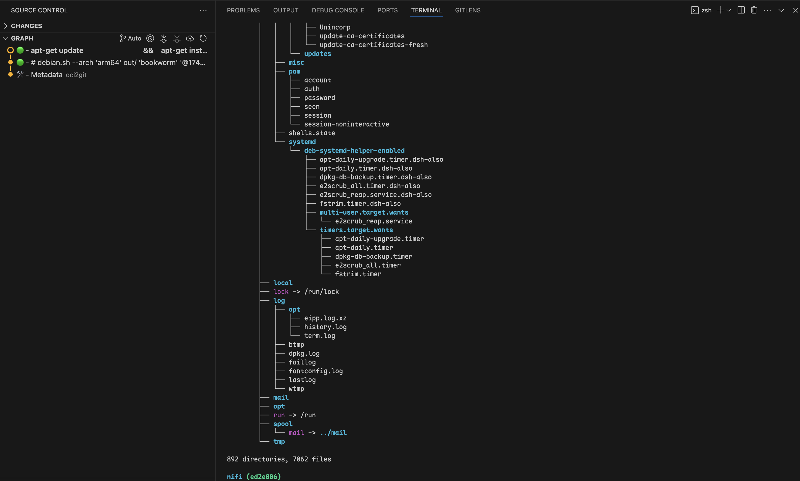

<div align="right">
  <details>
    <summary >🌐 Language</summary>
    <div>
      <div align="center">
        <a href="https://openaitx.github.io/view.html?user=Virviil&project=oci2git&lang=en">English</a>
        | <a href="https://openaitx.github.io/view.html?user=Virviil&project=oci2git&lang=zh-CN">简体中文</a>
        | <a href="https://openaitx.github.io/view.html?user=Virviil&project=oci2git&lang=zh-TW">繁體中文</a>
        | <a href="https://openaitx.github.io/view.html?user=Virviil&project=oci2git&lang=ja">日本語</a>
        | <a href="https://openaitx.github.io/view.html?user=Virviil&project=oci2git&lang=ko">한국어</a>
        | <a href="https://openaitx.github.io/view.html?user=Virviil&project=oci2git&lang=hi">हिन्दी</a>
        | <a href="https://openaitx.github.io/view.html?user=Virviil&project=oci2git&lang=th">ไทย</a>
        | <a href="https://openaitx.github.io/view.html?user=Virviil&project=oci2git&lang=fr">Français</a>
        | <a href="https://openaitx.github.io/view.html?user=Virviil&project=oci2git&lang=de">Deutsch</a>
        | <a href="https://openaitx.github.io/view.html?user=Virviil&project=oci2git&lang=es">Español</a>
        | <a href="https://openaitx.github.io/view.html?user=Virviil&project=oci2git&lang=it">Italiano</a>
        | <a href="https://openaitx.github.io/view.html?user=Virviil&project=oci2git&lang=ru">Русский</a>
        | <a href="https://openaitx.github.io/view.html?user=Virviil&project=oci2git&lang=pt">Português</a>
        | <a href="https://openaitx.github.io/view.html?user=Virviil&project=oci2git&lang=nl">Nederlands</a>
        | <a href="https://openaitx.github.io/view.html?user=Virviil&project=oci2git&lang=pl">Polski</a>
        | <a href="https://openaitx.github.io/view.html?user=Virviil&project=oci2git&lang=ar">العربية</a>
        | <a href="https://openaitx.github.io/view.html?user=Virviil&project=oci2git&lang=fa">فارسی</a>
        | <a href="https://openaitx.github.io/view.html?user=Virviil&project=oci2git&lang=tr">Türkçe</a>
        | <a href="https://openaitx.github.io/view.html?user=Virviil&project=oci2git&lang=vi">Tiếng Việt</a>
        | <a href="https://openaitx.github.io/view.html?user=Virviil&project=oci2git&lang=id">Bahasa Indonesia</a>
        | <a href="https://openaitx.github.io/view.html?user=Virviil&project=oci2git&lang=as">অসমীয়া</a>
      </div>
    </div>
  </details>
</div>

<div align="center">


# OCI2Git

[][documentation]
[](https://crates.io/crates/oci2git)
[](https://github.com/Virviil/oci2git/blob/master/LICENSE)
[](https://crates.io/crates/oci2git)

[//]: # (mock for future test.yaml)
[//]: # ([![Test Status]&#40;https://img.shields.io/github/actions/workflow/status/Virviil/oci2git/rust.yml?branch=master&event=push&label=Test&#41;]&#40;https://github.com/Virviil/oci2git/actions&#41;)

<div align="left"> </div>  
</div>

A Rust application that converts container images (Docker, etc.) to Git repositories. Each container layer is represented as a Git commit, preserving the history and structure of the original image.


## Features

- Analyze Docker images and extract layer information
- Create a Git repository where each image layer is represented as a commit
- Support for empty layers (ENV, WORKDIR, etc.) as empty commits
- Complete metadata extraction to Markdown format
- Extensible architecture for supporting different container engines

## Use Cases

### Layer Diffing
When troubleshooting container issues, you can use Git's powerful diffing capabilities to identify exactly what changed between any two layers. By running `git diff` between commits, engineers can see precisely which files were added, modified, or deleted, making it much easier to understand the impact of each Dockerfile instruction and locate problematic changes.


### Origin Tracking
Using `git blame`, developers can quickly determine which layer introduced a specific file or line of code. This is particularly valuable when diagnosing issues with configuration files or dependencies. Instead of manually inspecting each layer, you can immediately trace the origin of any file back to its source layer and corresponding Dockerfile instruction.

### File Lifecycle Tracking
OCI2Git enables you to follow a specific file's journey throughout the container image's history. You can observe when a file was initially created, how it was modified across layers, and if/when it was eventually removed. This comprehensive view helps understand file evolution without having to manually track changes across potentially dozens of layers.

To track the history of a file in your container image — including when it first appeared, was changed, or deleted — you can use these Git commands after conversion:

```bash
# Full history of a file (including renames)
git log --follow -- /rootfs/my/file/path

# First appearance (i.e. creation) - see which layer introduced the file
git log --diff-filter=A -- /rootfs/my/file/path

# All changes made to the file (with diffs)
git log -p --follow -- /rootfs/my/file/path

# When the file was deleted
git log --diff-filter=D -- /rootfs/my/file/path

# Show short commit info (concise layer history)
git log --follow --oneline -- /rootfs/my/file/path
```

These commands make it simple to trace any file's complete history across container layers without the complexity of manually extracting and comparing layer tarballs.

### Multi-Layer Analysis
Sometimes the most insightful comparisons come from examining changes across multiple non-consecutive layers. With OCI2Git, you can use Git's comparison tools to analyze how components evolved over multiple build stages, identifying patterns that might be invisible when looking only at adjacent layers.

### Layer Exploration
By using `git checkout` to move to any specific commit, you can examine the container filesystem exactly as it existed at that layer. This allows developers to inspect the precise state of files and directories at any point in the image's creation process, providing invaluable context when debugging or examining container behavior.


### Multi-Image Analysis

When working with multiple container images that share common ancestry, OCI2Git intelligently creates branches only when the images actually diverge. This allows you to analyze multiple related images in a single repository while preserving their common history.

```bash
# Convert first image to create the base repository
oci2git postgres:16.9-alpine3.21 -o alp

# Convert second image to the same output folder
oci2git nginx:1.28.0-alpine-slim -o alp
```

OCI2Git automatically detects shared layers between images and creates a branching structure that reflects their common base. The Git history will show:
- A common trunk containing all shared layers
- Separate branches that diverge only when the images actually differ
- Clear visualization of where images share common ancestry vs. where they become unique
- Smart duplicate handling: if the exact same image is processed twice, the algorithm detects this before the final metadata commit and skips creating a duplicate branch

This approach is particularly valuable for:
- **Image Family Analysis**: Understanding how different variants of an image (different versions, architectures, or configurations) relate to each other
- **Base Image Impact**: Seeing exactly how changes to a base image affect multiple derived images
- **Optimization Opportunities**: Identifying shared components that could be better leveraged across image variants


### Additional Use Cases

- **Security Auditing**: Identify exactly when vulnerable packages or configurations were introduced and trace them back to specific build instructions.
- **Image Optimization**: Analyze layer structures to find redundant operations or large files that could be consolidated, helping to reduce image size.
- **Dependency Management**: Monitor when dependencies were added, upgraded, or removed across the image history.
- **Build Process Improvement**: Examine layer composition to optimize Dockerfile instructions for better caching and smaller image size.
- **Cross-Image Comparison**: Convert multiple related images to Git repositories and use Git's comparison tools to analyze their differences and commonalities.

## Installation

### From Source

```bash
# Clone the repository
git clone https://github.com/virviil/oci2git.git
cd oci2git

# Install locally
cargo install --path .
```

### From Crates.io

```bash
cargo install oci2git
```

## Usage

```bash
oci2git [OPTIONS] <IMAGE>
```

Arguments:
  `<IMAGE>`  Image name to convert (e.g., 'ubuntu:latest') or path to tarball when using the tar engine

Options:
  `-o, --output <o>`  Output directory for Git repository [default: ./container_repo]
  `-e, --engine <ENGINE>`  Container engine to use (docker, nerdctl, tar) [default: docker]
  `-h, --help`            Print help information
  `-V, --version`         Print version information

Environment Variables:
  `TMPDIR`  Set this environment variable to change the default location used for intermediate data processing. This is platform-dependent (e.g., `TMPDIR` on Unix/macOS, `TEMP` or `TMP` on Windows).

## Examples

Using Docker engine (default):
```bash
oci2git -o ./ubuntu-repo ubuntu:latest
```

Using an already downloaded image tarball:
```bash
oci2git -e tar -o ./ubuntu-repo /path/to/ubuntu-latest.tar
```

The tar engine expects a valid OCI format tarball, which is typically created with `docker save`:
```bash
# Create a tarball from a local Docker image
docker save -o ubuntu-latest.tar ubuntu:latest

# Convert the tarball to a Git repository
oci2git -e tar -o ./ubuntu-repo ubuntu-latest.tar
```

This will create a Git repository in `./ubuntu-repo` containing:
- `Image.md` - Complete metadata about the image in Markdown format
- `rootfs/` - The filesystem content from the container

The Git history reflects the container's layer history:
- The first commit contains only the `Image.md` file with full metadata
- Each subsequent commit represents a layer from the original image
- Commits include the Dockerfile command as the commit message

## Repository Structure

```
repository/
├── .git/
├── Image.md     # Complete image metadata
└── rootfs/      # Filesystem content from the container
```


## Requirements

- Rust 2021 edition
- Docker CLI (for Docker engine support)
- Git

## License

MIT

[documentation]: https://docs.rs/oci2git/
